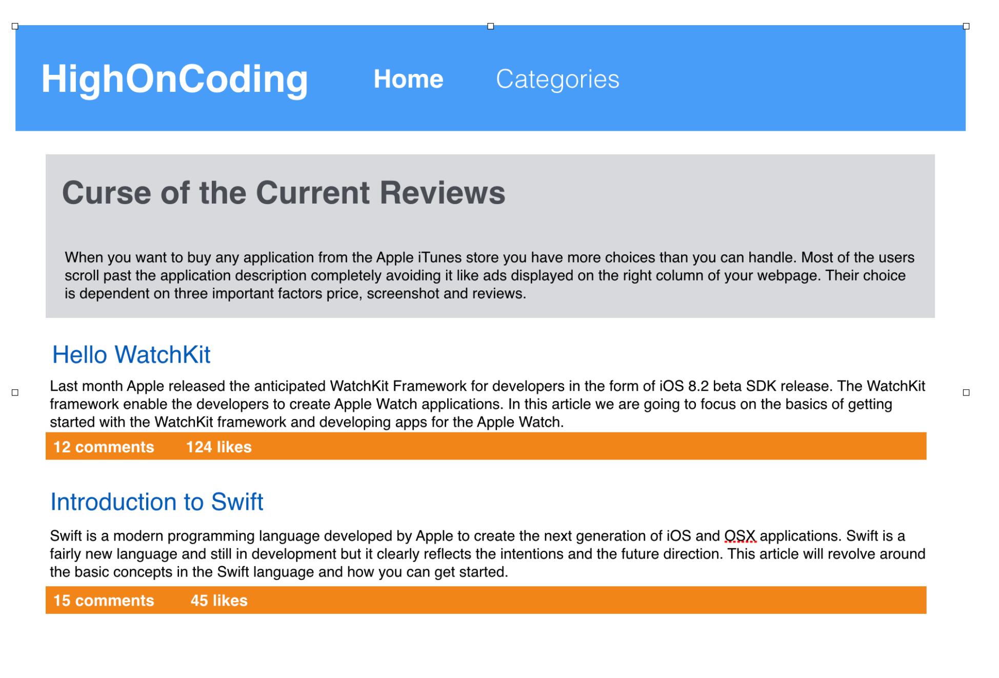
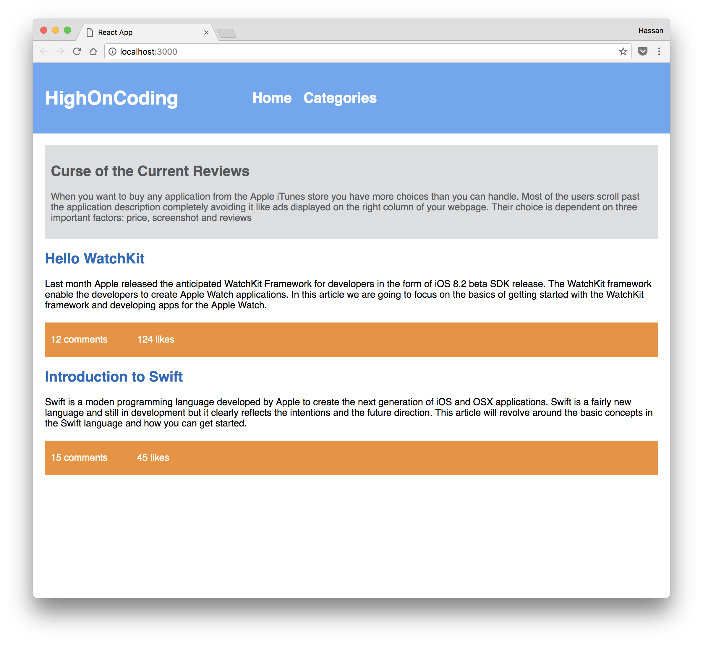

# react-high-on-coding
📘 An assignment to replicate the mockup of a website using React

## Assignment:
>In this assignment, you are going to create the UI of the HighOnCoding website using React components. How would you go about dividing the HighOnCoding website into separate components.

>Styling is not mandatory. The main purpose of this group discussion is to talk about how would you divide the website into smaller components.

### Mockup Provided:

### Completed Assignment:

